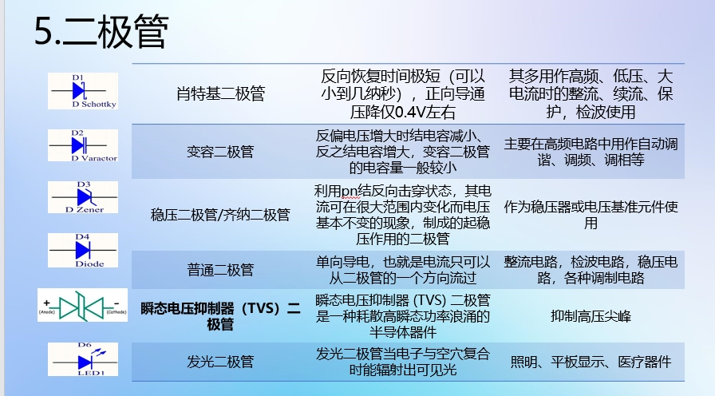

## 软件学习

### SoftTarget

- [ ] java基本语法复习完成
- [ ] 数据库菜鸟两节
- [ ] js 速通1/3
- [ ] echarts 画柱状图

### SoftNote

### HardTarget

- [ ] 入门篇 >= 5
- [ ] 熟悉元件

### HardNote

#### 电阻元件

电阻器(Resistor), R不随t变化下满足
$$u = Ri.$$

特点：
* 阻值固定，一般是两个引脚
* 阻值不能改变：固定电阻器；阻值可变：电位器/可变电阻器
* 端电压与电流有确定函数关系，体现电能转化为其他形式能力二端元件，单位 $\Omega$.

电阻读数
1. 插接式：按颜色，1+2(+3)确定阻值，后面是乘数和误差
2. 贴片式：按数字：
    1. 3位：前两位有效，第三位10的n次幂，精度+-5%
    2. 4位：精度+-1%
    3. 小于10$\Omega$的：数之间加上R：R003

#### 电容元件

电容(Capacitance)，容纳电荷本领。单位F,mF,miuF,nF,pF.

实际应用：根据电容“通交流，隔直流”，主要是储能和滤波.

$$u = \frac{1}{C}\int i\,dt$$

分类：贴片/插件，特性不同，有无极性

仅说明铝点解电容读法：

白线为极性负，直接有标称容量，耐压；

圆形的：黑色小半圆为负，读出耐压，容量，默认单位miuF.

#### 电感元件

电感(Inductor),能够把电能转化为磁能二存储起来，用 $L$ 表示.

单位：亨，H, mH, miuH

实际应用：根据电感“通直流，隔交流”，主要是滤波，扼流，谐振，储能.

$$u = L \frac{di}{dt}.$$

分类：贴片，插件

读法：
1. 色码标注：与电阻颜色一样，表不同。
2. 数码标注：前两位有效数，第三位为北城，单位mH.
3. 文字符号标注：小的用R隔开：1R5->1.5miuH

#### 二极管

箭头：是否是发光的。

分类：发光，普通，稳压(加了个小横杠)，光电(箭头指向内侧)，变容(两个竖杠)。

以D开头。

例子：

1. 电源：单向导通，整流桥，对交流电整流。
2. 信号处理：将二极管与电容构成检波电路，对前级输入的调制信号进行检波。
3. 电源输入端加一个二极管，进行防反接。
4. 电源电压不稳定，加入稳压二极管。

导通压降，死区电压，反向击穿电压(稳压特性)

长正短负。贴片绿色点的是负极。

焊板上竖杠为负极。

#### 三极管

NPN,PNP型。

作用：将微弱的信号放大为幅值较大的电信号。有电流放大作用。

三极管是在一块半导体基片上制作两个相距很近的PN结，两个PN结把整块半导体分成三部分，中间部分是基区，两侧部分是发射区和集电区。

以Q开头。

判断类型：箭头一直是P=>N.

PN结：是一种特殊的半导体结，它有两个不同类型的半导体材料(通常是N型和P型)组成，他们在他们的交界面形成一个空间电荷区。PN结具有单向导电性。

原理图区分：NPN：共阳极，PNP：共阴极。

输出特性：
1. 截止状态。发射结反偏，集电结反偏。
2. 放大区，发射结正偏，集电结反偏。满足$$i_{c} = k i_{b}$$
3. 饱和状态，发射结正偏，集电结正偏。
