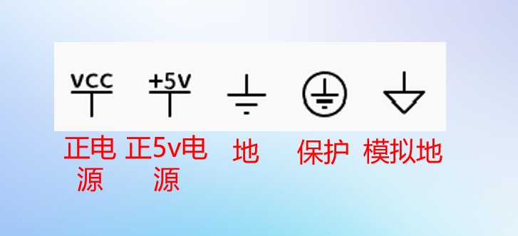

## 调车任务

- [ ] 引入变参pid，多种
- [ ] 初步测试旋转直线

## 软件学习

### SoftTarget

- [x] 数据库菜鸟一节

### SoftNote

## 硬件学习

### HardTarget

- [ ] 一节视频，读懂原理图
- [x] 熟悉基本元件性质
- [ ] 一节寄存器

### HardNote

#### 原理图

在原理图中，结点是导线共通的点。

网络标签(Net Label): 表示一个电气连接点，具有<u>*相同网络标签*</u>的器件表明是电气连接在一起。

常用电源网络标签

#### 电路定理

* 支路：电路中的<u>每一分支</u>叫做支路。支路是由一个或几个串联的电路元件构成的，是构成复杂电路的基本单元。支路是电路中<u>通过同一电流的通路</u>

* 回路/闭合回路：电路中任意一个<u>闭合</u>路径叫做回路。至少包含<u>**一个**</u>没有选用过的新支路时，称独立回路。

* 网孔：<u>*不可再分*</u>的回路叫做网孔。对平面电路，内部不含任何支路的回路称网孔。电路中的<u>*网孔数*</u>等于<u>*独立回路数*</u>。最简电路

**基尔霍夫定律**

>介绍：
>
>基尔霍夫定律包括基尔霍夫电流定律（KCL）和基尔霍夫电压定律（KVL）。它反映了电路中所有支路电压和电流所遵循的基本规律，是分析集总参数电路的基本定律。基尔霍夫定律与元件自身的特性构成了电路分析的基础。

1. 集总参数电路

实际电路元件一般都和电能的消耗及电能，磁能的储存有关，他们交织在一起发生在整个元件中。一个实际元件可以用一到多个理想元件组合表示。

理想化：假定这些现象可以分别研究，并且这些电磁过程都分别*集中在各元件内部进行*，这样的元件成为集总参数元件。 也就工作时是不会影响到其他元件

用集总参数电路模型来近似描述实际电路是有条件的，他要求实际电路的尺寸要远小于电路工作时电磁波的波长。

